# GoBirdie User's Manual

## Table of Contents

1. [Starting a Round](#1-starting-a-round)
2. [Playing a Hole](#2-playing-a-hole)
3. [Using the Map](#3-using-the-map)
4. [Putting & Finishing a Hole](#4-putting--finishing-a-hole)
5. [Reviewing Scorecards](#5-reviewing-scorecards)
6. [Settings](#6-settings)
7. [Apple Watch](#7-apple-watch)
8. [Exploring Courses](#8-exploring-courses)
9. [Syncing to Desktop](#9-syncing-to-desktop)
10. [Tips](#tips)

---

## 1. Starting a Round

<table>
<tr><td valign="top" width="60%">

### Step 0: Open GoBirdie

Open the app and you'll see the inistial screen with No Active Round.

</td><td valign="top">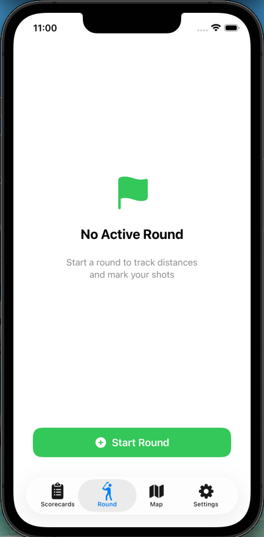</td></tr>
</table>

<table>
<tr><td valign="top">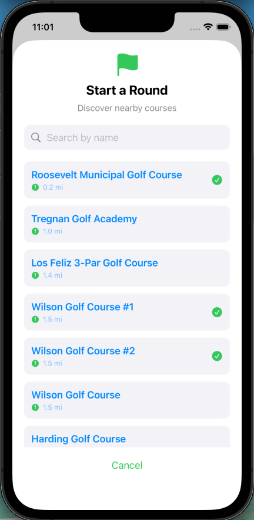</td><td valign="top" width="60%">

### Step 1: Find Your Course

Once you clicked Start a round button, nearby courses are listed automatically, sorted by distance. Previously downloaded courses appear instantly while online results load in the background.

</td></tr>
</table>

<table>
<tr><td valign="top" width="60%">

### Step 2: Search by Name (Optional)

If your course isn't listed, tap the search bar and type the course name. Results are fetched from OpenStreetMap with a large search radius.

</td><td valign="top">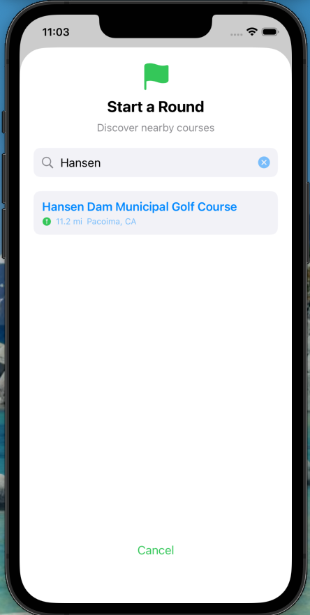</td></tr>
</table>

<table>
<tr><td valign="top">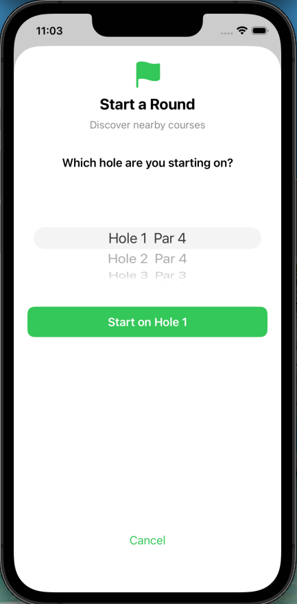</td><td valign="top" width="60%">

### Step 3: Select Your Starting Hole

After selecting a course, choose which hole to start from. This is useful if you're starting on the back nine or a specific hole.

</td></tr>
</table>

<table>
<tr><td valign="top" width="60%">

### Step 4: Begin the Round

Once you've selected the course and starting hole, the round begins. You'll see the hole info bar at the top and the mini scorecard at the bottom.

</td><td valign="top">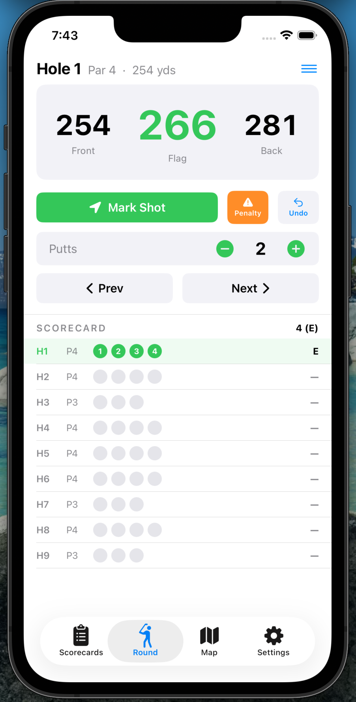</td></tr>
</table>

---

## 2. Playing a Hole

<table>
<tr><td valign="top">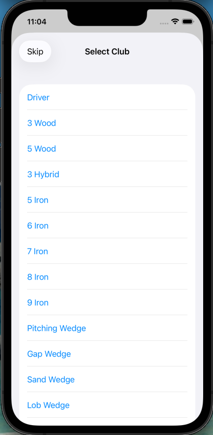</td><td valign="top" width="60%">

### Step 4: Select Your Club

After each shot, tap **Mark Shot** to drop a GPS pin at your current location. A club selection sheet appears — pick the club you used. You can customize the club list in Settings → Clubs.

</td></tr>
</table>

<table>
<tr><td valign="top" width="60%">

### Step 5: Track Your Progress

Your shots appear on the map as colored dots connected by lines. Each line shows the distance in yards between shots. The current hole's info (par, yardage, handicap) is displayed at the top, and the mini scorecard tracks your running score at the bottom.

</td><td valign="top">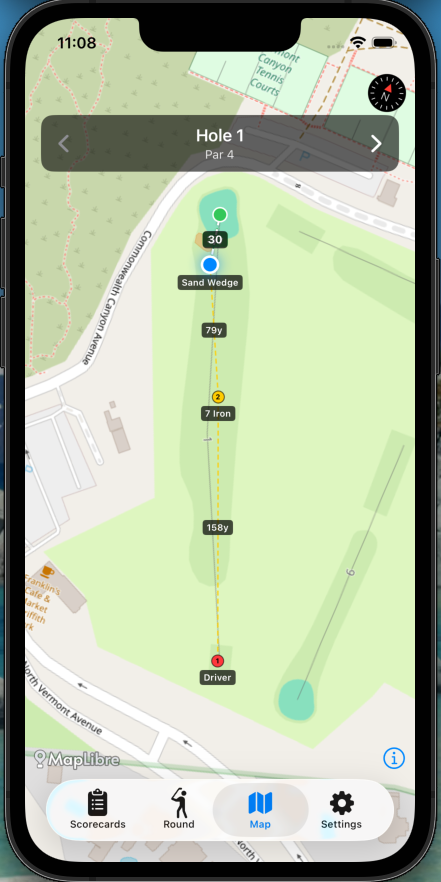</td></tr>
</table>

---

## 3. Using the Map

<table>
<tr><td valign="top"></td><td valign="top" width="60%">

### Step 6: Read Distances

The map automatically rotates and zooms to show the hole from tee to green. Your position is shown as a blue pulsing dot, and the green is marked with a green dot. A dashed line shows the distance from you to the pin.

</td></tr>
</table>

<table>
<tr><td valign="top" width="60%">

### Step 7: Tap to Measure

Tap anywhere on the map to measure distances. Two lines appear:
- **White line** — distance from your current position to the tapped point
- **Green line** — distance from the tapped point to the green

This is useful for planning layups or checking carry distances over hazards.

</td><td valign="top">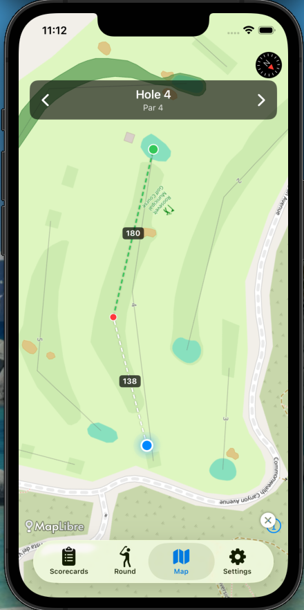</td></tr>
</table>

---

## 4. Putting & Finishing a Hole

<table>
<tr><td valign="top">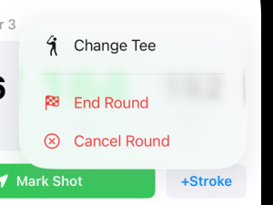</td><td valign="top" width="60%">

### Step 8: Enter Putts

Enter number of putts with + / − buttons and click next to move to next hole. Finish button shows up at the last hole. You can click on it to finish and save the game. Optionally, the menu button on the top-right corner shows End Round / Cancel Round which can be used any time during the round.

</td></tr>
</table>

<table>
<tr><td valign="top" width="60%">

### Step 9: Navigate Between Holes

Use the **< >** arrows in the hole info bar to move between holes. You can go back to a previous hole to correct a score if needed. On the last hole, advancing ends the round.

</td><td valign="top"></td></tr>
</table>

---

## 5. Reviewing Scorecards

<table>
<tr><td valign="top" width="60%">

### Step 10: View Past Rounds

Tap the **Scorecards** tab to see all completed rounds. Each card shows the course name, date, total score, and score vs par.

</td></tr>
</table>

<table>
<tr><td valign="top" width="60%">

### Step 11: Scorecard Detail

Tap a round to see the full scorecard with per-hole breakdown: score, putts, fairway hit, and number of tracked shots.

</td><td valign="top">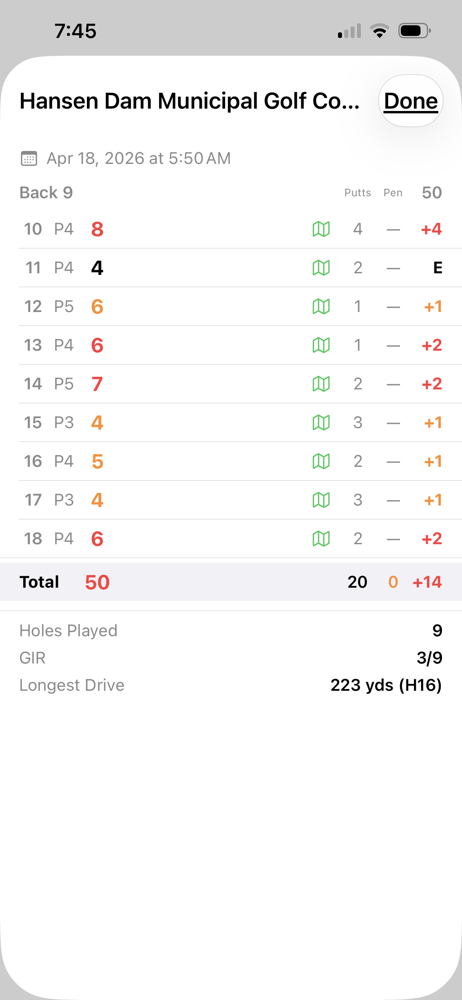</td></tr>
</table>

<table>
<tr><td valign="top">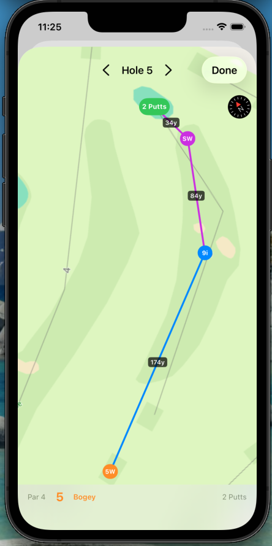</td><td valign="top" width="60%">

### Step 12: Shot Map

Scroll down in the scorecard detail to see the shot map. Each hole's shots are plotted on the map with club-colored dots, distance lines, and a putt count at the green. The map is rotated to align tee-to-green vertically.

</td></tr>
</table>

<table>
<tr><td valign="top" width="60%">

### Step 13: Edit Shot Map

Tap **Edit** in the shot map view to adjust shot locations, club selections, or putt count. Drag pins to move shots, tap to select and delete shots, tap on the map to add new shots, and use the **+/−** buttons to adjust putts. Changes are saved when you tap **Done**.

</td><td valign="top">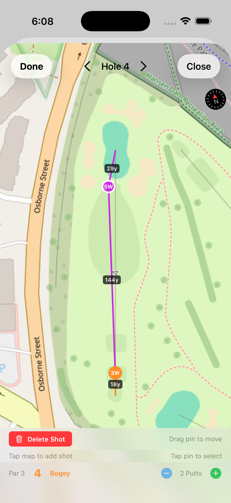</td></tr>
</table>

<table>
<tr><td valign="top">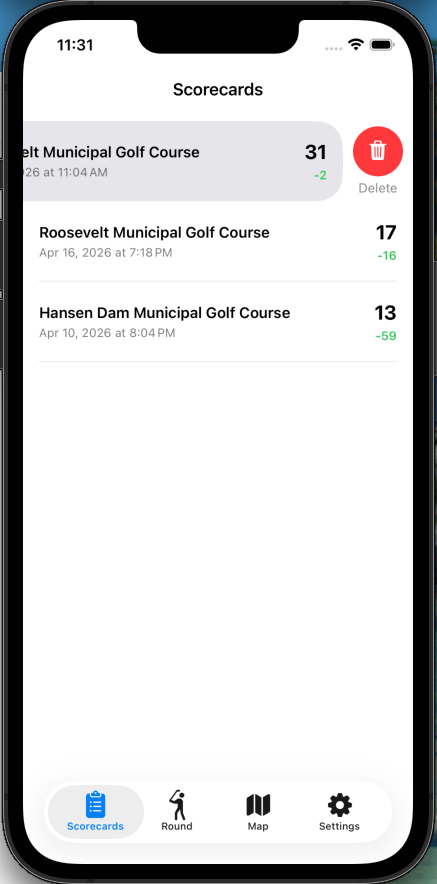</td><td valign="top" width="60%">

### Step 14: Delete a Round

On the scorecards list, swipe left on any round to delete it.

</td></tr>
</table>

<table>
<tr><td valign="top" width="60%">

### Step 15: Resume a Round

Accidentally ended a round? Swipe right on any completed round to reveal a green **Resume** button. Tapping it converts the round back to an in-progress session at the last hole you played — your shots, putts, and scores are all preserved.

</td><td valign="top">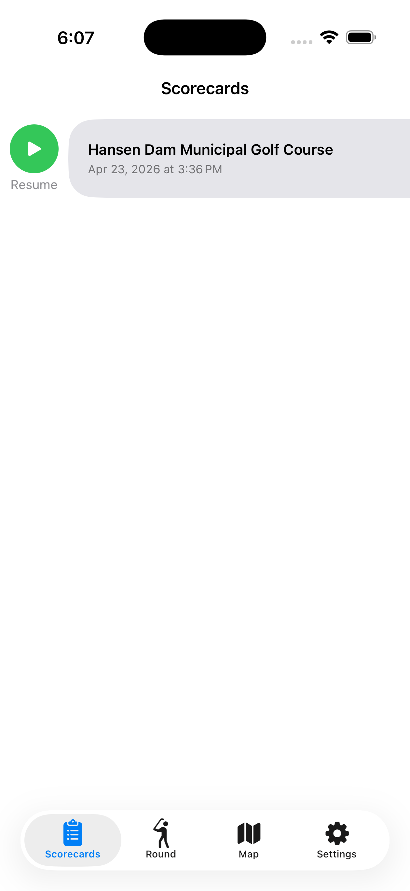</td></tr>
</table>

---

## 6. Settings

<table>
<tr><td valign="top" width="60%">

### Step 16: Settings Overview

Tap the **Settings** tab to access app configuration. From here you can manage your clubs, download courses, toggle desktop sync, and more.

</td><td valign="top">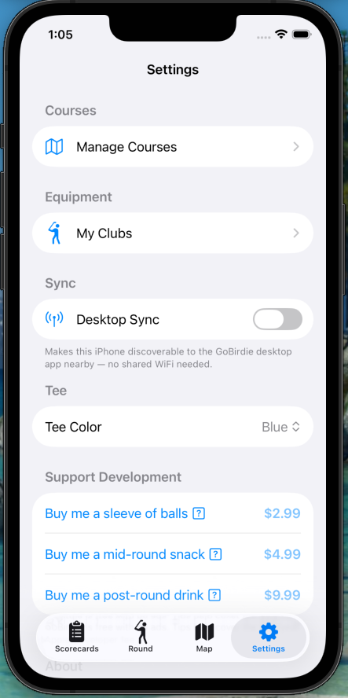</td></tr>
</table>

<table>
<tr><td valign="top">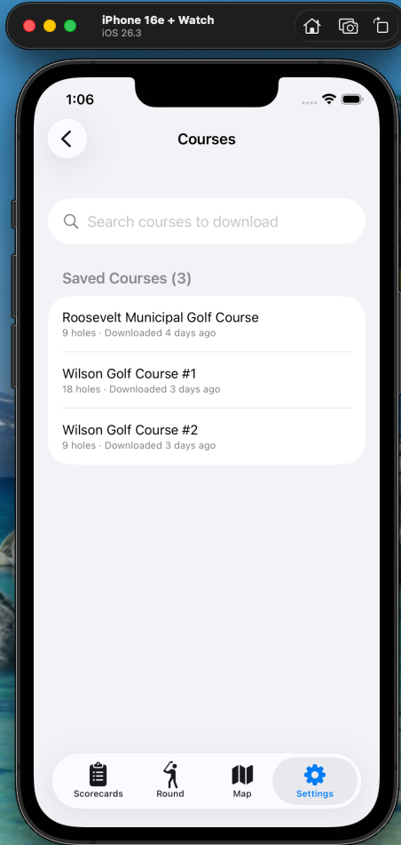</td><td valign="top" width="60%">

### Step 17: Manage Courses

Search and pre-download courses for offline use. View saved courses and swipe to delete ones you no longer need.

</td></tr>
</table>

<table>
<tr><td valign="top" width="60%">

### Step 18: Customize Your Clubs

Add or remove clubs from your bag. The club list is used when marking shots during a round. For example, add a 4-Hybrid and remove a 4-Iron to match your actual bag.

</td><td valign="top">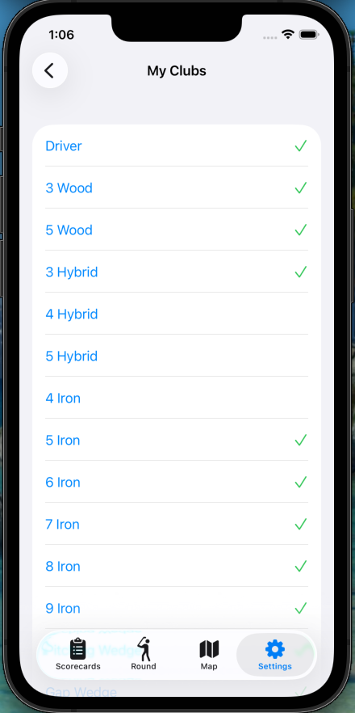</td></tr>
</table>

---

## 7. Apple Watch

The Apple Watch app works as a companion to the iPhone — it receives hole data via WatchConnectivity and provides quick distance checks and shot tracking from your wrist.

<table>
<tr><td valign="top" width="60%">

### Step 19: Start on Watch

When you start a round on the iPhone, the Watch shows the course name. Tap **Start** to begin the workout session (enables background GPS and always-on display).

</td><td valign="top">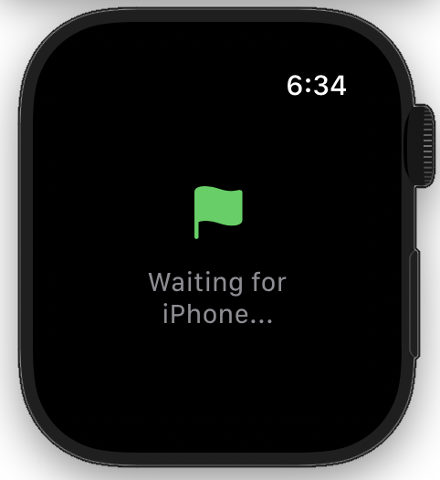</td></tr>
</table>

<table>
<tr><td valign="top">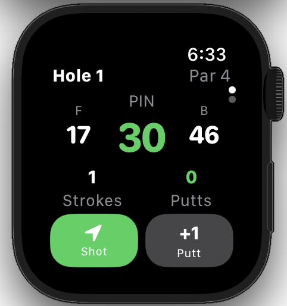</td><td valign="top" width="60%">

### Step 20: Distances & Shot Tracking

The Watch displays live distances to the **Front**, **Pin**, and **Back** of the green in a compact layout, updated continuously from Watch GPS. Below the distances, your current **Strokes** and **Putts** are shown. Use the buttons to:
- **Shot** — mark a shot at your current GPS location (opens club selection)
- **+1 Putt** — add a putt to the current hole

Rotate the **Digital Crown** to navigate between holes. Stroke and putt counts sync automatically with the iPhone.

</td></tr>
</table>

<table>
<tr><td valign="top" width="60%">

### Step 20b: Club Selection on Watch

After tapping **Shot**, a club picker overlay appears. Rotate the **Digital Crown** or swipe left/right to scroll through your clubs, then tap to confirm. The selected club is recorded with the shot and synced to the iPhone.

</td><td valign="top">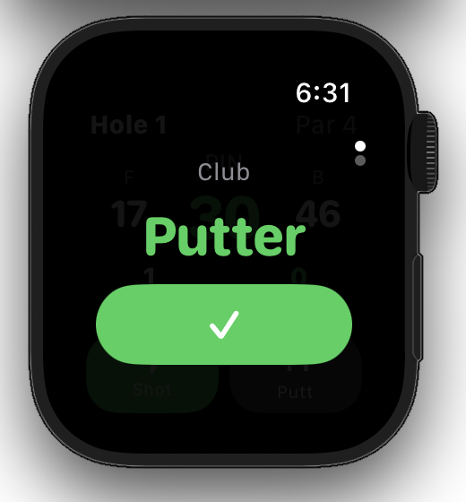</td></tr>
</table>

<table>
<tr><td valign="top">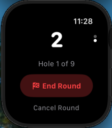</td><td valign="top" width="60%">

### Step 21: End the Round

Swipe to the second page to see your total score and access **End Round** or **Cancel Round**.

</td></tr>
</table>

<table>
<tr><td valign="top" width="60%">

### Step 22: Round Saved

After ending the round, the Watch confirms the save with your final score. The round data is sent back to the iPhone.

</td><td valign="top">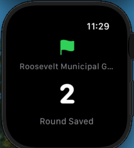</td></tr>
</table>

---

## 8. Exploring Courses

Browse course layouts without tracking a round. This is useful to use this app as course map + range finder only.

<table>
<tr><td valign="top">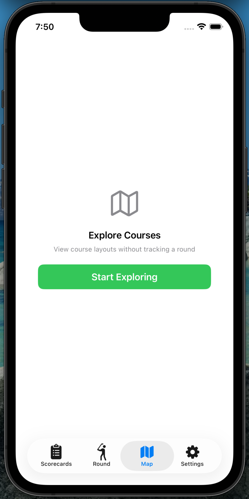</td><td valign="top" width="60%">

### Step 23: Start Exploring

Tap the **Map** tab and select **Start Exploring** to enter explore mode. Nearby courses are listed automatically, sorted by distance.

</td></tr>
</table>

<table>
<tr><td valign="top" width="60%">

### Step 24: Search for Courses

Use the search bar to find courses by name. Results are fetched from OpenStreetMap with a large search radius.

</td><td valign="top">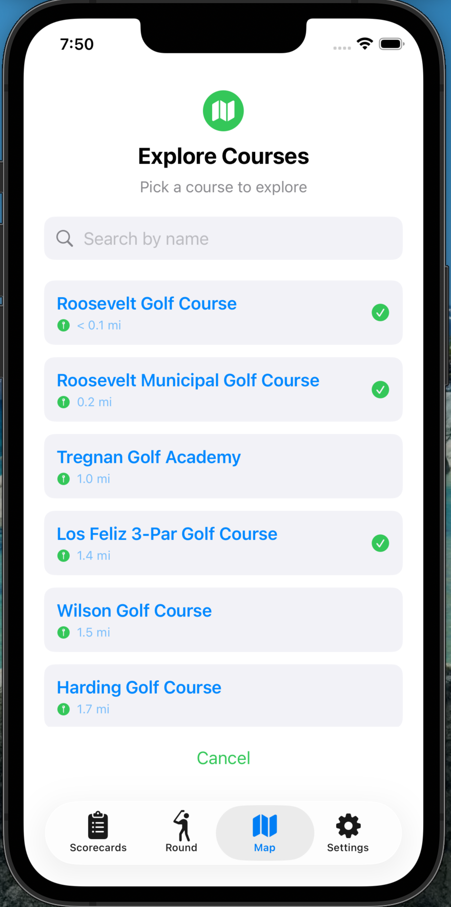</td></tr>
</table>

<table>
<tr><td valign="top">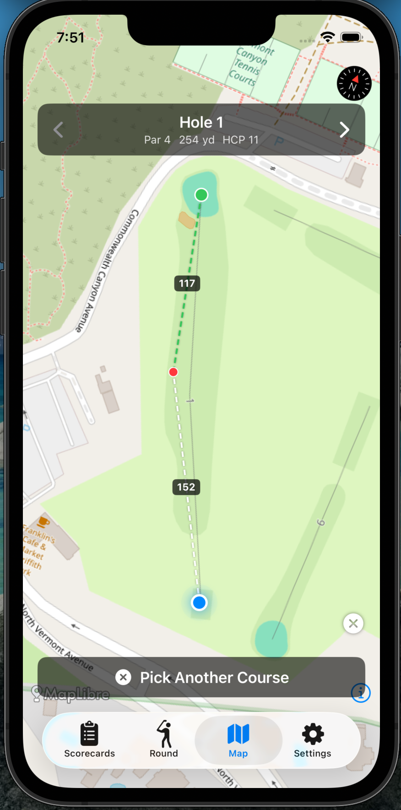</td><td valign="top" width="60%">

### Step 25: View Course Layout

Once a course is loaded, view the hole layout on the map. Navigate between holes using the **< >** arrows. Tap on the map to measure distances from any point to the green — useful for visualizing carry distances and hazards.

</td></tr>
</table>

---

## 9. Syncing to Desktop

GoBirdie syncs rounds to the [GoBirdie Desktop](https://github.com/nicechester/GoBirdie-Desktop) companion app over MultipeerConnectivity (Bluetooth + WiFi peer-to-peer). No network configuration is needed — it works even if your iPhone and desktop are on different WiFi networks.

### Step 26: Enable Sync

1. Open **Settings** on the iPhone app
2. Toggle **Desktop Sync** on
3. On the desktop app, click **Sync from iPhone**
4. The desktop discovers the iPhone automatically and pulls all new rounds

Round data includes shot positions, club selections, heart rate, altitude, and green center coordinates. The desktop app provides timeline charts, shot analysis, and course statistics.

---

## Tips

- **Customize your clubs** — Go to Settings → Clubs to add/remove clubs from the selection list (e.g., add a 4-Hybrid, remove 4-Iron)
- **Crash recovery** — The app auto-saves your round every 30 seconds. If the app crashes or your phone restarts, your round will be restored when you reopen
- **Resume a round** — Ended a round by accident? Swipe right on the scorecard to resume where you left off
- **Idle detection** — After 30 minutes of no interaction, the app asks "Are you still playing?" to prevent accidental battery drain
- **Orientation lock** — The screen is locked to portrait during a round to prevent accidental rotation
