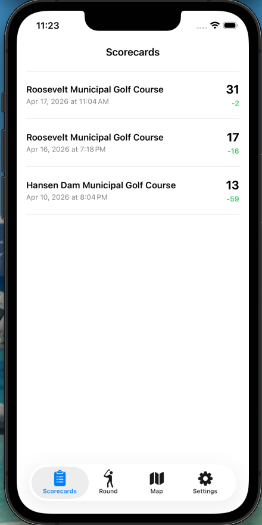

# GoBirdie User's Manual

## Table of Contents

1. [Starting a Round](#1-starting-a-round)
2. [Playing a Hole](#2-playing-a-hole)
3. [Using the Map](#3-using-the-map)
4. [Putting & Finishing a Hole](#4-putting--finishing-a-hole)
5. [Reviewing Scorecards](#5-reviewing-scorecards)
6. [Apple Watch](#6-apple-watch)
7. [Syncing to Desktop](#7-syncing-to-desktop)

---

## 1. Starting a Round

### Step 1: Find Your Course

Open the app and you'll see the **Start Round** screen. Nearby courses are listed automatically, sorted by distance. Previously downloaded courses appear instantly while online results load in the background.

### Step 2: Search by Name (Optional)

If your course isn't listed, tap the search bar and type the course name. Results are fetched from OpenStreetMap with a large search radius.

### Step 3: Select Your Starting Hole

After selecting a course, choose which hole to start from. This is useful if you're starting on the back nine or a specific hole.

### Step 4: Begin the Round

Once you've selected the course and starting hole, the round begins. You'll see the hole info bar at the top and the mini scorecard at the bottom.

---

## 2. Playing a Hole

### Step 5: Mark Your Shots

After each shot, tap **Mark Shot** to drop a GPS pin at your current location. A club selection sheet appears — pick the club you used.

Your shots appear on the map as colored dots connected by lines. Each line shows the distance in yards between shots. The current hole's info (par, yardage, handicap) is displayed at the top, and the mini scorecard tracks your running score at the bottom.

---

## 3. Using the Map

### Step 6: Read Distances

The map automatically rotates and zooms to show the hole from tee to green. Your position is shown as a blue pulsing dot, and the green is marked with a green dot. A dashed line shows the distance from you to the pin.

### Step 7: Tap to Measure

Tap anywhere on the map to measure distances. Two lines appear:
- **White line** — distance from your current position to the tapped point
- **Green line** — distance from the tapped point to the green

This is useful for planning layups or checking carry distances over hazards. Tap elsewhere to update, or the lines disappear when you mark your next shot.

---

## 4. Putting & Finishing a Hole

### Step 8: Enter Putts

When you're within 30 yards of the pin, the app detects you're on the green. A green dashed line appears from your last shot to the flag. Use the putt controls to enter your putt count, then advance to the next hole.

### Step 9: Navigate Between Holes

Use the **< >** arrows in the hole info bar to move between holes. You can go back to a previous hole to correct a score if needed. On the last hole, advancing ends the round.

---

## 5. Reviewing Scorecards

### Step 10: View Past Rounds

Tap the **Scorecards** tab to see all completed rounds. Each card shows the course name, date, total score, and score vs par.

### Step 11: Scorecard Detail

Tap a round to see the full scorecard with per-hole breakdown: score, putts, fairway hit, and number of tracked shots.

### Step 12: Shot Map

Scroll down in the scorecard detail to see the shot map. Each hole's shots are plotted on the map with club-colored dots, distance lines, and a putt count at the green. The map is rotated to align tee-to-green vertically for easy reading.

### Step 13: Delete a Round

On the scorecards list, swipe left on any round to delete it.

---

## 6. Apple Watch

The Apple Watch app works as a companion to the iPhone — it receives hole data via WatchConnectivity and provides quick distance checks and shot tracking from your wrist.

### Step 14: Start on Watch

When you start a round on the iPhone, the Watch shows the course name. Tap **Start** to begin the workout session (enables background GPS and always-on display).

### Step 15: Distances & Shot Tracking

The Watch displays live distances to the **Front**, **Pin**, and **Back** of the green, updated continuously from Watch GPS. Use the buttons to:
- **Shot** — mark a shot at your current GPS location
- **+1 Stroke** — add a stroke without marking a location

Rotate the **Digital Crown** to navigate between holes.

### Step 16: End the Round

Swipe to the second page to see your total score and access **End Round** or **Cancel Round**.

### Step 17: Round Saved

After ending the round, the Watch confirms the save with your final score. The round data is sent back to the iPhone.

---

## 7. Syncing to Desktop

GoBirdie syncs rounds to the [GoBirdie Desktop](../../desktop/GoBirdie-Desktop) companion app over MultipeerConnectivity (Bluetooth + WiFi peer-to-peer). No network configuration is needed — it works even if your iPhone and desktop are on different WiFi networks.

### Step 18: Enable Sync

1. Open **Settings** on the iPhone app
2. Toggle **Desktop Sync** on
3. On the desktop app, click **Sync from iPhone**
4. The desktop discovers the iPhone automatically and pulls all new rounds

Round data includes shot positions, club selections, heart rate, altitude, and green center coordinates. The desktop app provides timeline charts, shot analysis, and course statistics.

---

## Tips

- **Customize your clubs** — Go to Settings → Clubs to add/remove clubs from the selection list (e.g., add a 4-Hybrid, remove 4-Iron)
- **Crash recovery** — The app auto-saves your round every 30 seconds. If the app crashes or your phone restarts, your round will be restored when you reopen
- **Idle detection** — After 30 minutes of no interaction, the app asks "Are you still playing?" to prevent accidental battery drain
- **Orientation lock** — The screen is locked to portrait during a round to prevent accidental rotation
